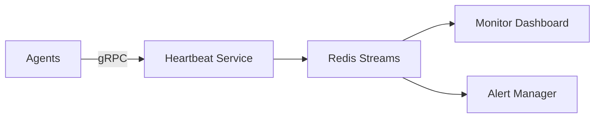
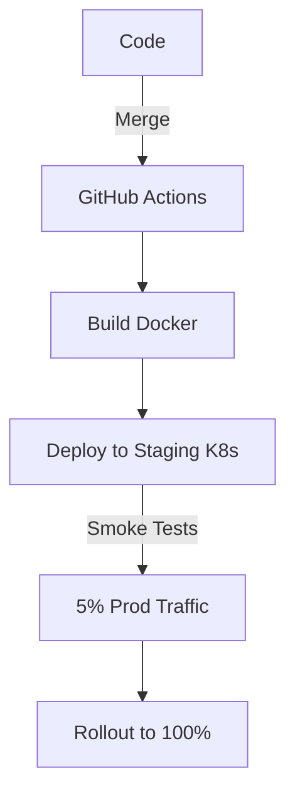

# Current Objective: Complete MachinaForge System Development

## Primary Goal
Finalize the development and implementation of the MachinaForge system to achieve a fully functional multi-agent orchestration platform with robust task management, monitoring, and role assignment capabilities.

## Key Deliverables

### 1. Template Development
- **Objective Templates**: Create standardized templates for defining agent objectives with clear success criteria, constraints, and execution parameters
- **Task Templates**: Develop reusable task templates that can be instantiated across different agent roles and contexts
- **Role Templates**: Build comprehensive role definition templates that specify capabilities, permissions, and behavioral guidelines

### 2. Agent Task Heartbeat Registry
- **Heartbeat Monitoring System**: Implement real-time monitoring of agent task execution status and health
- **Registry Architecture**: Build centralized registry for tracking active agents, their current tasks, and execution states
- **Failure Detection**: Develop automated detection and alerting for agent failures or task stalls
- **Recovery Mechanisms**: Create automated recovery and task reassignment protocols

### 3. Role Assignment System
- **Dynamic Role Allocation**: Implement intelligent role assignment based on agent capabilities and current workload
- **Load Balancing**: Develop algorithms for optimal distribution of tasks across available agents
- **Role Hierarchy Management**: Create system for managing agent roles, permissions, and escalation paths
- **Conflict Resolution**: Build mechanisms for handling role conflicts and resource contention

### 4. System Integration & Testing
- **End-to-End Testing**: Comprehensive testing of the complete MachinaForge workflow
- **Performance Optimization**: Ensure system can handle expected load and scale requirements
- **Documentation**: Complete technical documentation and user guides
- **Deployment Pipeline**: Finalize deployment and configuration management

## Success Criteria
- All templates are functional and properly integrated
- Heartbeat registry maintains 99.9% uptime and accuracy
- Role assignment operates with minimal latency and optimal resource utilization
- System demonstrates stable operation under production-level workloads

## Timeline Considerations
- Prioritize core heartbeat and monitoring functionality
- Implement role assignment system with basic load balancing
- Develop templates incrementally, starting with most critical use cases
- Plan for iterative testing and refinement throughout development

## Dependencies & Risks
- Ensure adequate infrastructure for registry and monitoring components
- Validate template schemas work across all intended use cases
- Test role assignment algorithms under various load scenarios
- Plan for backward compatibility with existing system components
### Expanded MachinaForge System Development Plan  

#### **1. Template Development**  
**Objective Templates**  
- **Structure**: JSON/YAML schemas with fields:  
  ```json
  {
    "objective_id": "unique_hash",
    "success_metrics": ["accuracy > 95%", "latency < 200ms"],
    "constraints": ["max_duration=5m", "gpu_only"],
    "dependencies": ["preprocessing_task"],
    "escalation_path": "supervisor_agent"
  }
  ```  
- **Validation**: Schema enforcement via OpenAPI specs; version control in Git.  
- **Lifecycle**: Templates auto-generate UI forms in admin dashboard.  

**Task Templates**  
- **Modular Design**: Atomic tasks (e.g., `data_fetch`, `model_inference`) with input/output slots.  
- **Reusability**: Template library tagged by domain (NLP, CV, analytics).  
- **Parameters**: Overridable defaults (e.g., `timeout=30s` → `timeout=120s`).  

**Role Templates**  
- **RBAC Matrix**:  
  | Permission        | Analyst | Engineer | Admin |  
  |-------------------|---------|----------|-------|  
  | Start tasks       | ✓       | ✓        | ✓     |  
  | Modify agents     | ✗       | ✓        | ✓     |  
  | Access logs       | Partial | ✓        | ✓     |  
- **Behavioral Guards**: Predefined ethical rules (e.g., "Cannot override safety constraints").  

---  

#### **2. Agent Task Heartbeat Registry**  
**Architecture**  

- **Data Model**:  
  ```proto
  message Heartbeat {
    string agent_id = 1;
    string task_id = 2;
    Status status = 3; // RUNNING, STALLED, COMPLETED
    int64 timestamp = 4;
    float cpu_util = 5;
  }
  ```  

**Failure Handling**  
- **Stall Detection**: Agent marked `STALLED` if heartbeat missing for 3 intervals.  
- **Recovery Workflow**:  
  1. Alert sent to `RecoveryService`  
  2. Task snapshot saved to S3  
  3. Reassigned to nearest-capable agent via `RoleAssigner`  

---  

#### **3. Role Assignment System**  
**Dynamic Allocation Logic**  
```python
def assign_role(task, agents):
  eligible = [a for a in agents if 
              a.has_capability(task.requirements) and 
              a.load < MAX_LOAD]
  return min(eligible, key=lambda a: a.load + network_latency(a))
```  
- **Load Balancing**:  
  - **Metric**: Weighted score = `(pending_tasks × complexity) / agent_throughput`  
  - **Scale**: Horizontal pod autoscaling (K8s) triggered at 75% cluster load.  

**Conflict Resolution**  
- **Deadlock Prevention**: Optimistic concurrency control (ETags) for role assignment.  
- **Contention Handling**:  
  - Priority-based preemption (high-priority tasks reclaim resources)  
  - Fallback to queued execution with exponential backoff.  

---  

#### **4. System Integration & Testing**  
**Testing Pyramid**  
- **Unit**: Template schema validation, heartbeat encryption  
- **Integration**: RoleAssigner + HeartbeatRegistry interaction  
- **Load**: Locust tests simulating 10k agents @ 100 msg/sec  
- **Chaos**: Random agent termination (Netem + ChaosMesh)  

**Deployment Pipeline**  


---  

### **Risk Mitigation**  
| Risk                          | Mitigation Strategy                          | Owner       |  
|-------------------------------|----------------------------------------------|-------------|  
| Registry latency spikes       | Redis cluster sharding + read replicas       | Infra Team  |  
| Template version drift        | Immutable template hashes in S3              | DevOps      |  
| Agent overload cascades       | Circuit breakers in task assignment          | SRE         |  

### **Timeline (Phased)**  
1. **Week 1-2**: Heartbeat MVP (monitoring + alerts)  
2. **Week 3-4**: Role assignment v1 (basic load balancing)  
3. **Week 5-6**: Template engine + integration testing  
4. **Week 7**: Security audit & performance tuning  

> **Critical Path**: Heartbeat system completion (blocks role assignment testing).  
> **Go-Live**: Requires 72-hour stability test with 500+ simulated agents.
