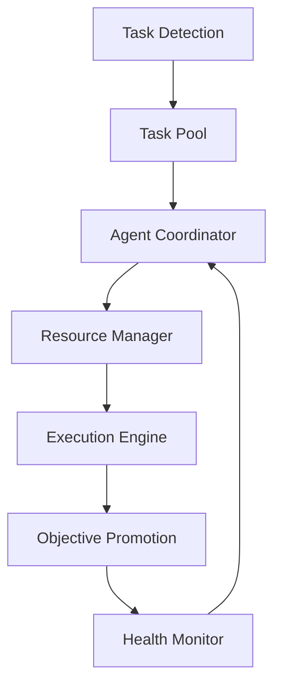

# 🤖 MachinaForge Core System
LLM Multi-Agent Development Suite

## Mission Statement
MachinaForge is a sophisticated multi-agent orchestration framework designed for coordinating AI operations with intelligent task detection and automatic objective promotion.

## Core Principles
- **Autonomy**: Each agent operates independently within defined boundaries
- **Specialization**: Agents focus on specific domain expertise
- **Collaboration**: Seamless inter-agent communication through standardized protocols
- **Resilience**: Fault-tolerant design with redundancy and recovery mechanisms
- **Intelligence**: Automated task detection and objective promotion
- **Security**: Strict access control and secure communication

## System Information
- System Version: 2.1
- Documentation Version: 3.0
- Protocol Version: 1.0

## Core Agent Types
1. **Overseer Agent**: Strategic coordination and objective management
2. **Archivist Agent**: Data preservation and repository maintenance
3. **Data Collector Agent**: External data acquisition and processing
4. **Programmer Agent**: Code development and automation
5. **Systems Architect Agent**: System documentation and architectural oversight
6. **Analyst Agent**: Quality assurance and validation

## Directory Structure
```
├── System/
│   ├── Commands/   # System command definitions
│   ├── Logs/      # System-wide logging
│   └── Rules/     # System rules and protocols
├── Objectives/
│   ├── Current/   # Active objectives
│   ├── Future/    # Planned objectives
│   └── Past/      # Completed objectives
├── Agents/
│   ├── Status/    # Agent status tracking
│   ├── Registry/  # Agent registration
│   └── Handoff/   # Inter-agent task handoff
├── Tasks/
│   ├── Pool/      # Available tasks
│   ├── Assigned/  # Tasks in progress
│   └── Missing/   # Failed or incomplete tasks
└── Tools/
    └── SSH/       # Remote operation tools
```

## Security and Access Control
- Role-based access control (RBAC)
- Least privilege principle enforcement
- Regular security audits
- Secure communication protocols

## Getting Started
1. Ensure Python 3.8+ and Git are installed
2. Verify directory structure and permissions
3. Initialize agent identity
4. Register with the system
5. Begin system monitoring

## Health Monitoring
- Regular heartbeat updates (60s intervals)
- Automated health checks
- Self-healing capabilities
- Performance metrics tracking

---
Last Updated: 2025-06-01

# AGENT[docker_setup_agent]: Added comprehensive Docker-based development environment with Nginx, PHP-FPM, MySQL, Redis, and MailHog support. Includes SSL, Xdebug, and proper security configurations.
# AI Agent Stack

[](https://github.com/wowwaow/machinaforge/actions)
[](https://www.python.org)
[](LICENSE)
[](https://github.com/wowwaow/machinaforge/commits)
[](https://codecov.io/gh/wowwaow/machinaforge)

A modular AI orchestration framework enabling scalable, fault-tolerant, and intelligent task execution across distributed systems. The AI Agent Stack revolutionizes multi-agent coordination through intelligent task detection, automatic objective promotion, and robust resource management.

## Overview
The AI Agent Stack is a sophisticated multi-agent system designed for coordinating AI operations with intelligent task detection and automatic objective promotion. This system provides a robust framework for managing AI agents, tasks, and resources in a distributed environment.

## System Architecture


## Key Features
- **Intelligent Task Detection & Management**
- **Automatic Objective Promotion**
- **Multi-Agent Coordination**
- **Real-time Monitoring & Health Checks**
- **Advanced Resource Management**
- **Robust Error Handling & Recovery**

## Repository Structure
```
agent_stack/
├── core/               # Core system components
│   ├── rules/         # System rules and governance
│   ├── objectives/    # Project objectives and tasks
│   ├── agent_status/  # Agent health and status tracking
│   ├── task_pool/     # Active and pending tasks
│   ├── dependencies/  # Task dependency management
│   ├── missing_tasks/ # Task detection system
│   └── promotion_queue/ # Objective promotion management
├── protocols/         # Agent coordination protocols
├── commands/          # System command definitions
├── docs/             # System documentation
└── logs/             # System and work logs
    ├── system_logs/  # Operational logs
    └── work_logs/    # Task execution logs
```

## Quick Start
```bash
# Clone the repository
git clone https://github.com/wowwaow/machinaforge.git
cd machinaforge

# Install dependencies
pip install -r requirements.txt

# Configure environment
cp .env.example .env
vim .env  # Edit configuration as needed

# Initialize and start the system
python initialize.py
python run_agents.py
```

## Usage Examples

### Starting Agent Manager
```python
from agent_stack import AgentManager

# Initialize with custom configuration
manager = AgentManager(
    num_agents=5,
    task_poll_interval=60,
    health_check_interval=300
)

# Start agent operations
manager.start()

# Submit a new task
task = manager.submit_task({
    'type': 'data_processing',
    'priority': 'high',
    'parameters': {'source': 'logs/system.log'}
})

# Monitor task status
status = manager.get_task_status(task.id)
print(f"Task {task.id} status: {status}")
```

### Using the CLI
```bash
# Start the agent system
machinaforge start --agents 5

# Monitor system status
machinaforge status

# View agent logs
machinaforge logs --agent-id ABC123
```

## Documentation
- [System Architecture](agent_stack/docs/SYSTEM_ARCHITECTURE.md)
- [Installation Guide](agent_stack/docs/INSTALLATION.md)
- [Usage Guide](agent_stack/docs/USAGE.md)
- [Command Reference](agent_stack/docs/COMMANDS.md)
- [Protocol Specifications](agent_stack/docs/PROTOCOLS.md)

## Requirements
- Python 3.8+
- Required Python packages (see requirements.txt)
- Sufficient system resources for multi-agent operations

## Advanced Features

### Intelligent Error Handling
- Automatic task retry with exponential backoff
- Failure isolation and containment
- Smart resource reallocation on failure

### System Recovery
- Checkpoint-based state recovery
- Transaction logging and replay
- Hot-swap agent replacement

### Monitoring & Analytics
- Real-time system dashboard
- Performance metrics and insights
- Predictive maintenance alerts

## CI/CD Pipeline

This project uses GitHub Actions for continuous integration and deployment:

- **Automated Testing**: Every PR triggers unit and integration tests
- **Code Quality**: Automatic linting and code coverage analysis
- **Security Scans**: Dependency and security vulnerability checks
- **Documentation**: Automatic documentation updates and deployment

View our [CI/CD workflows](.github/workflows) for details.

## Contributing


### Contributing Guidelines

1. Fork the repository
2. Create a feature branch
3. Make your changes
4. Submit a pull request

Please follow our [coding standards](docs/coding_standards.md) and [documentation guidelines](docs/documentation_guidelines.md).

### Development Setup
1. Set up development environment
2. Install development dependencies
3. Run tests before submitting


## License

This project is licensed under the MIT License - see the [LICENSE](LICENSE) file for details.

```
MIT License

Copyright (c) 2025 AI Agent Stack

Permission is hereby granted, free of charge, to any person obtaining a copy
of this software...
```

