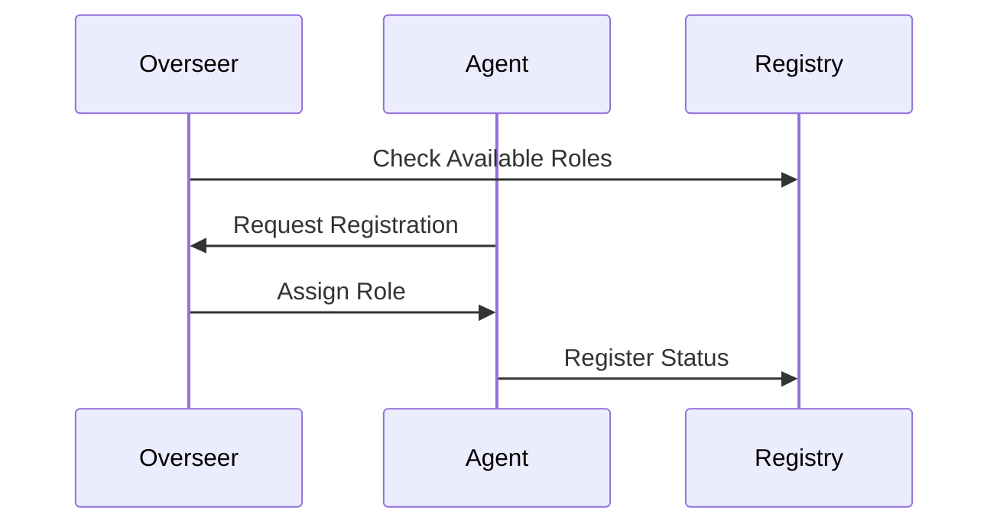
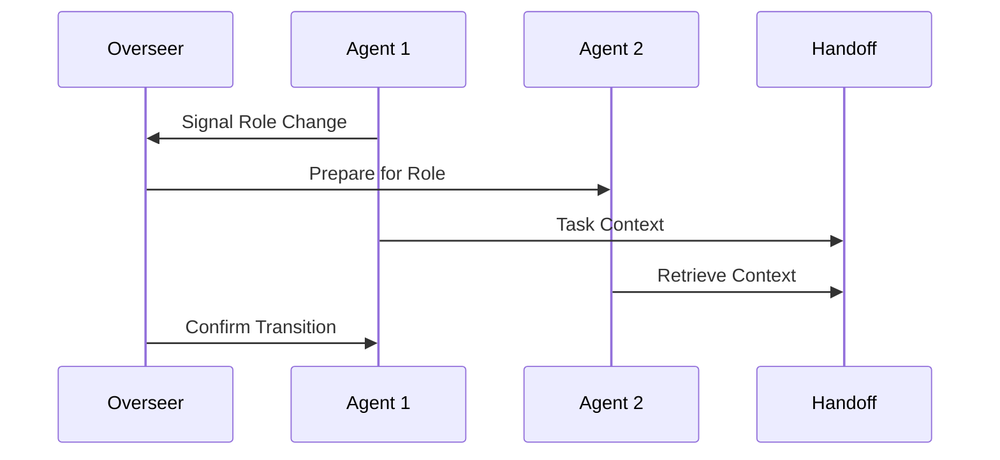

# 🤖 MachinaForge Agent System

## Overview

The MachinaForge agent system consists of specialized autonomous agents working together to achieve system objectives. Each agent type has specific responsibilities and operates independently while maintaining collaboration through standardized protocols.

## Core Agent Types

### 1. Overseer Agent
**Primary Responsibility**: Strategic coordination and objective management

#### Key Functions:
- System-wide task coordination
- Role registry management
- Dynamic agent reassignment
- Performance monitoring
- Resource allocation oversight

#### Interaction Patterns:
- Receives status updates from all agents
- Dispatches high-level directives
- Manages agent role transitions
- Coordinates emergency responses

### 2. Archivist Agent
**Primary Responsibility**: Data preservation and repository maintenance

#### Key Functions:
- Backup operations management
- Version control oversight
- Data integrity verification
- Archive maintenance
- Recovery point creation

#### Interaction Patterns:
- Coordinates with all agents for data preservation
- Regular system state snapshots
- Manages data retention policies
- Handles recovery requests

### 3. Data Collector Agent
**Primary Responsibility**: External data acquisition and processing

#### Key Functions:
- Web scraping operations
- Data transformation
- Format standardization
- Source verification
- Data validation

#### Interaction Patterns:
- Reports to Overseer Agent
- Coordinates with Archivist for storage
- Feeds processed data to Analyst Agent
- Maintains data source registry

### 4. Programmer Agent
**Primary Responsibility**: Code development and automation

#### Key Functions:
- Code generation
- Script maintenance
- Integration management
- Code optimization
- Documentation updates

#### Interaction Patterns:
- Collaborates with Systems Architect
- Receives requirements from Overseer
- Coordinates with Analyst for testing
- Updates Archivist with code changes

### 5. Systems Architect Agent
**Primary Responsibility**: System documentation and architectural oversight

#### Key Functions:
- Architecture maintenance
- System documentation
- Path management
- Integration planning
- Performance optimization

#### Interaction Patterns:
- Guides Programmer Agent
- Reports to Overseer Agent
- Coordinates with all agents for documentation
- Reviews system changes

### 6. Analyst Agent
**Primary Responsibility**: Quality assurance and validation

#### Key Functions:
- Test suite development
- Performance analysis
- Quality metrics tracking
- Issue detection
- Optimization recommendations

#### Interaction Patterns:
- Reports findings to Overseer
- Coordinates with Programmer for fixes
- Provides feedback to Systems Architect
- Validates Data Collector output

## Agent Lifecycle

### 1. Initialization


### 2. Operation
- Regular heartbeat updates (60s intervals)
- Task processing and reporting
- Resource usage monitoring
- Error handling and recovery

### 3. Role Transition


## Agent Communication

### 1. Status Updates
- Regular heartbeat messages
- Task completion reports
- Resource utilization metrics
- Error notifications

### 2. Task Management
- Task assignment acceptance
- Progress updates
- Completion notifications
- Resource requests

### 3. Coordination
- Role transition requests
- Resource allocation
- Task dependencies
- Emergency protocols

## Health Monitoring

### 1. Agent Health Metrics
- CPU usage
- Memory utilization
- Task throughput
- Response times
- Error rates

### 2. Recovery Procedures
- Self-diagnostic checks
- Automatic error recovery
- Role reassignment
- State restoration

## Security

### 1. Agent Authentication
- Unique agent identifiers
- Role-based access control
- Secure communication channels
- Token-based authentication

### 2. Access Control
- Task-specific permissions
- Resource access limits
- Audit logging
- Security policy enforcement

## Configuration

### 1. Agent Settings
```yaml
agent:
  id: ${AGENT_ID}
  role: ${AGENT_ROLE}
  priority: ${PRIORITY_LEVEL}
  resources:
    cpu_limit: ${CPU_LIMIT}
    memory_limit: ${MEMORY_LIMIT}
  intervals:
    heartbeat: 60
    status_update: 300
```

### 2. Role-Specific Settings
```yaml
role_config:
  overseer:
    scan_interval: 30
    max_agents: 10
  archivist:
    backup_interval: 3600
    retention_period: 30
  collector:
    fetch_interval: 300
    max_concurrent: 5
```

Last Updated: 2025-06-02

