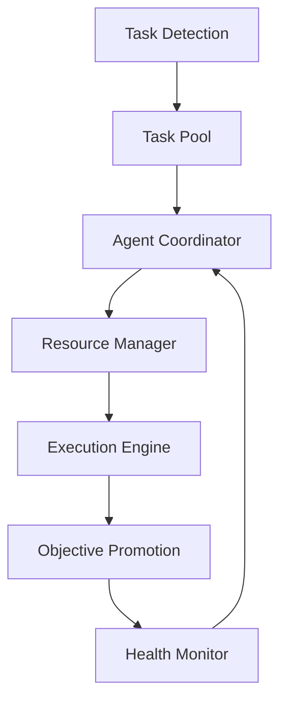

# 🏗️ MachinaForge System Architecture

## System Overview

MachinaForge is built as a distributed multi-agent system with a focus on modularity, resilience, and intelligent task management. This document outlines the core architectural components and their interactions.

## System Components



### Core Components

1. **Task Detection System**
   - Monitors system for new tasks
   - Classifies and prioritizes tasks
   - Routes tasks to appropriate queues

2. **Agent Coordinator**
   - Manages agent lifecycle
   - Handles role assignments
   - Coordinates inter-agent communication

3. **Resource Manager**
   - Allocates system resources
   - Monitors resource utilization
   - Implements load balancing

4. **Execution Engine**
   - Processes task workflows
   - Manages task dependencies
   - Handles task completion and failure

5. **Health Monitor**
   - Tracks system vitals
   - Implements fault detection
   - Triggers recovery procedures

## Directory Structure

```
├── System/
│   ├── Commands/   # System command definitions
│   ├── Logs/      # System-wide logging
│   └── Rules/     # System rules and protocols
├── Objectives/
│   ├── Current/   # Active objectives
│   ├── Future/    # Planned objectives
│   └── Past/      # Completed objectives
├── Agents/
│   ├── Status/    # Agent status tracking
│   ├── Registry/  # Agent registration
│   └── Handoff/   # Inter-agent task handoff
├── Tasks/
│   ├── Pool/      # Available tasks
│   ├── Assigned/  # Tasks in progress
│   └── Missing/   # Failed or incomplete tasks
└── Tools/
    └── SSH/       # Remote operation tools
```

## Data Flow

1. **Task Ingestion**
   - Task detection
   - Priority assignment
   - Queue placement

2. **Task Processing**
   - Agent assignment
   - Resource allocation
   - Execution monitoring

3. **Result Handling**
   - Output validation
   - Result storage
   - Status updates

## System States

1. **Initialization**
   - Environment verification
   - Directory structure validation
   - Agent registration

2. **Operation**
   - Task processing
   - Resource management
   - Health monitoring

3. **Recovery**
   - Error detection
   - State restoration
   - Agent reassignment

## Security Architecture

1. **Access Control**
   - Role-based permissions
   - Token-based authentication
   - Session management

2. **Data Protection**
   - Encryption at rest
   - Secure communication
   - Audit logging

## Monitoring and Metrics

1. **System Metrics**
   - Resource utilization
   - Task throughput
   - Error rates

2. **Agent Metrics**
   - Health status
   - Task completion rates
   - Response times

## Scalability

1. **Horizontal Scaling**
   - Agent pool expansion
   - Load distribution
   - Resource allocation

2. **Vertical Scaling**
   - Resource optimization
   - Performance tuning
   - Capacity planning

## Error Handling

1. **Detection**
   - Error classification
   - Impact assessment
   - Alert generation

2. **Recovery**
   - State restoration
   - Task reassignment
   - Resource reallocation

## Version Management

- System Version: 2.1
- Documentation Version: 3.0
- Protocol Version: 1.0

## Future Considerations

1. **Performance Optimization**
   - Task scheduling improvements
   - Resource utilization optimization
   - Communication protocol enhancements

2. **Feature Extensions**
   - Additional agent types
   - Enhanced monitoring capabilities
   - Advanced recovery mechanisms

Last Updated: 2025-06-01

