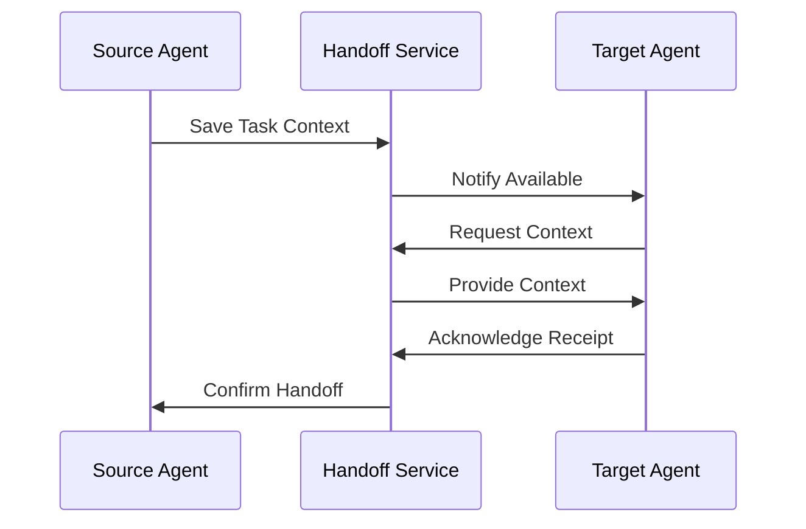
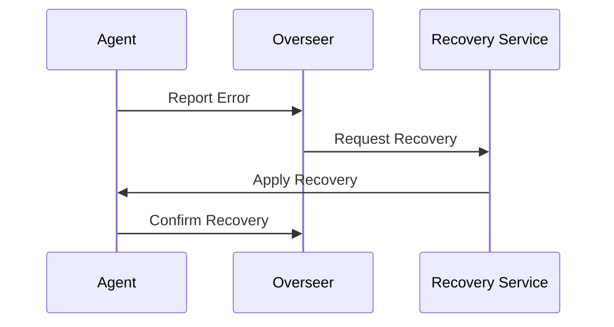
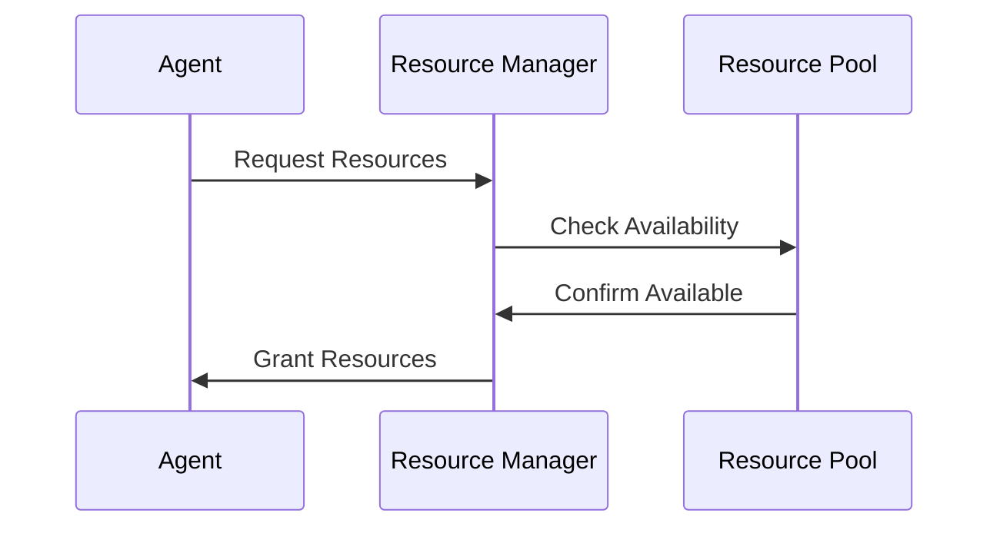
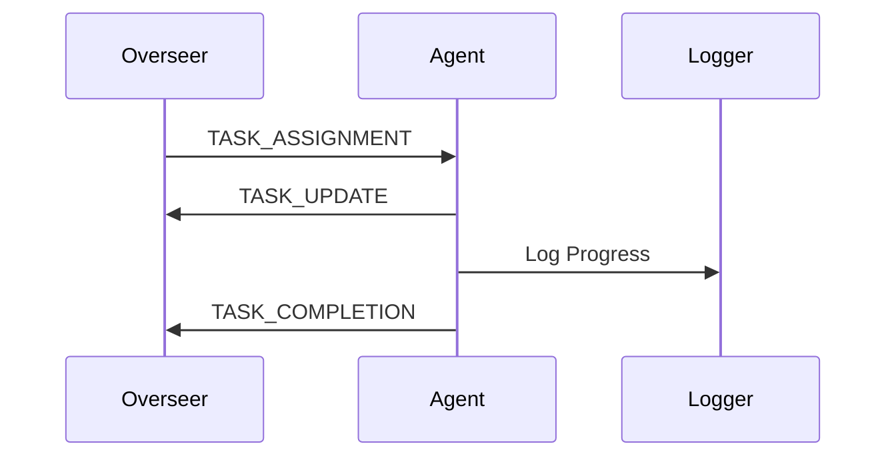
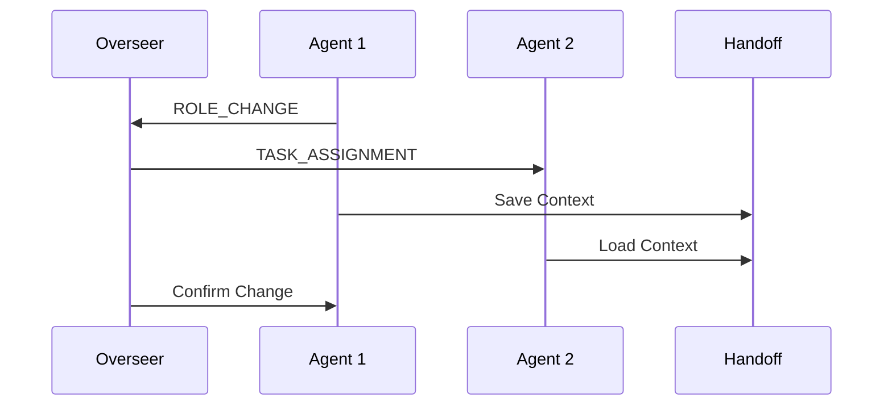

# 📡 MachinaForge Communication Protocols

## Overview

MachinaForge implements a robust set of communication protocols to ensure reliable, secure, and efficient inter-agent communication. These protocols define the standards for message formats, handoff procedures, and coordination mechanisms.

## Message Protocol

### 1. Message Format
```json
{
    "message_id": "msg_uuid",
    "timestamp": "2025-06-01T20:00:00Z",
    "sender": {
        "agent_id": "agent_uuid",
        "role": "agent_role"
    },
    "recipient": {
        "agent_id": "target_uuid",
        "role": "target_role"
    },
    "type": "message_type",
    "priority": 1,
    "content": {},
    "metadata": {
        "session_id": "session_uuid",
        "correlation_id": "correlation_uuid"
    }
}
```

### 2. Message Types
1. **System Messages**
   - HEARTBEAT
   - STATUS_UPDATE
   - ROLE_CHANGE
   - ERROR_REPORT

2. **Task Messages**
   - TASK_ASSIGNMENT
   - TASK_UPDATE
   - TASK_COMPLETION
   - TASK_FAILURE

3. **Resource Messages**
   - RESOURCE_REQUEST
   - RESOURCE_GRANT
   - RESOURCE_RELEASE
   - RESOURCE_DENIAL

4. **Control Messages**
   - SHUTDOWN
   - RESTART
   - PAUSE
   - RESUME

### 3. Priority Levels
1. CRITICAL (1): Immediate attention required
2. HIGH (2): Process within 5 minutes
3. MEDIUM (3): Process within 15 minutes
4. LOW (4): Process within 60 minutes

## Handoff Protocol

### 1. Task Handoff Format
```json
{
    "handoff_id": "handoff_uuid",
    "timestamp": "2025-06-01T20:00:00Z",
    "source_agent": {
        "id": "source_uuid",
        "role": "source_role"
    },
    "target_agent": {
        "id": "target_uuid",
        "role": "target_role"
    },
    "task_context": {
        "task_id": "task_uuid",
        "state": "task_state",
        "progress": 0.75,
        "resources": {},
        "dependencies": []
    },
    "metadata": {
        "reason": "handoff_reason",
        "priority": 1
    }
}
```

### 2. Handoff Procedure


## Coordination Protocol

### 1. Role Registration
```json
{
    "registration_id": "reg_uuid",
    "timestamp": "2025-06-01T20:00:00Z",
    "agent": {
        "id": "agent_uuid",
        "role": "agent_role",
        "capabilities": ["cap1", "cap2"]
    },
    "status": {
        "health": "healthy",
        "load": 0.5,
        "tasks_active": 2
    }
}
```

### 2. Health Updates
```json
{
    "health_id": "health_uuid",
    "timestamp": "2025-06-01T20:00:00Z",
    "agent_id": "agent_uuid",
    "metrics": {
        "cpu_usage": 0.45,
        "memory_usage": 0.6,
        "task_count": 3,
        "error_count": 0
    },
    "status": "healthy"
}
```

## Security Protocol

### 1. Authentication
```json
{
    "auth_request": {
        "agent_id": "agent_uuid",
        "timestamp": "2025-06-01T20:00:00Z",
        "token": "encrypted_token",
        "signature": "request_signature"
    }
}
```

### 2. Secure Communication
- All messages must be encrypted
- Use TLS 1.3+ for transport
- Implement message signing
- Validate all certificates

## Error Handling Protocol

### 1. Error Report Format
```json
{
    "error_id": "error_uuid",
    "timestamp": "2025-06-01T20:00:00Z",
    "agent_id": "agent_uuid",
    "error": {
        "type": "error_type",
        "severity": "high",
        "message": "error_description",
        "stack_trace": "trace_data"
    },
    "context": {
        "task_id": "task_uuid",
        "state": "task_state"
    }
}
```

### 2. Recovery Protocol


## Resource Protocol

### 1. Resource Request Format
```json
{
    "request_id": "req_uuid",
    "timestamp": "2025-06-01T20:00:00Z",
    "agent_id": "agent_uuid",
    "resources": {
        "cpu_cores": 2,
        "memory_mb": 1024,
        "disk_space_mb": 5000
    },
    "priority": 1,
    "duration": 3600
}
```

### 2. Resource Allocation


## Message Flow Examples

### 1. Task Assignment


### 2. Role Transition


## Protocol Versioning

### Current Versions
- Message Protocol: 1.0
- Handoff Protocol: 1.0
- Security Protocol: 1.0
- Resource Protocol: 1.0

### Version Compatibility
- Support previous version
- Forward compatible design
- Version negotiation
- Graceful degradation

Last Updated: 2025-06-01

